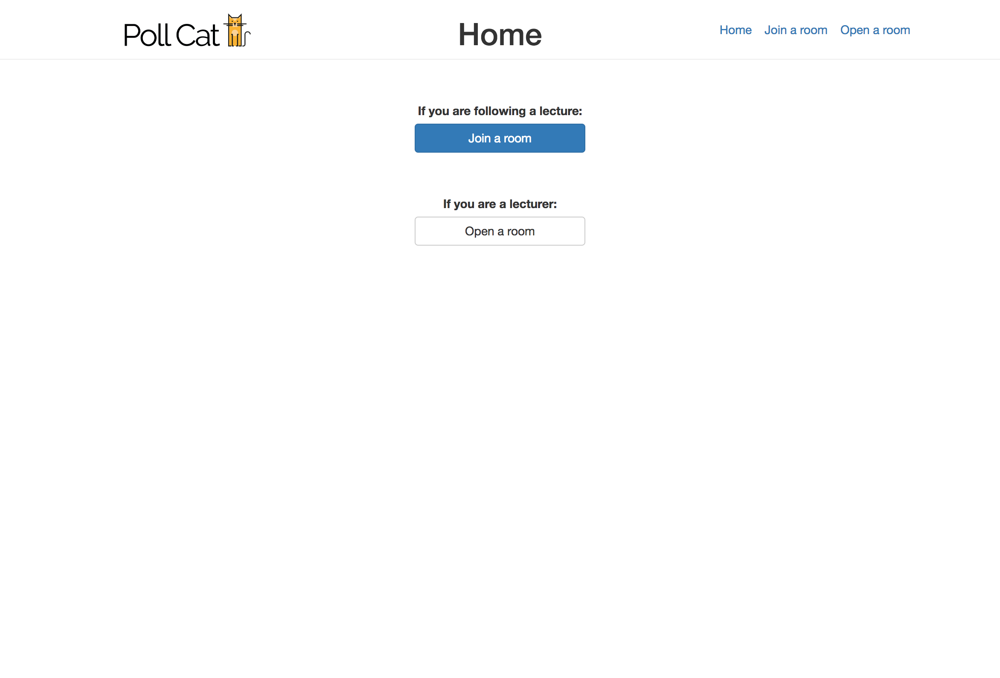
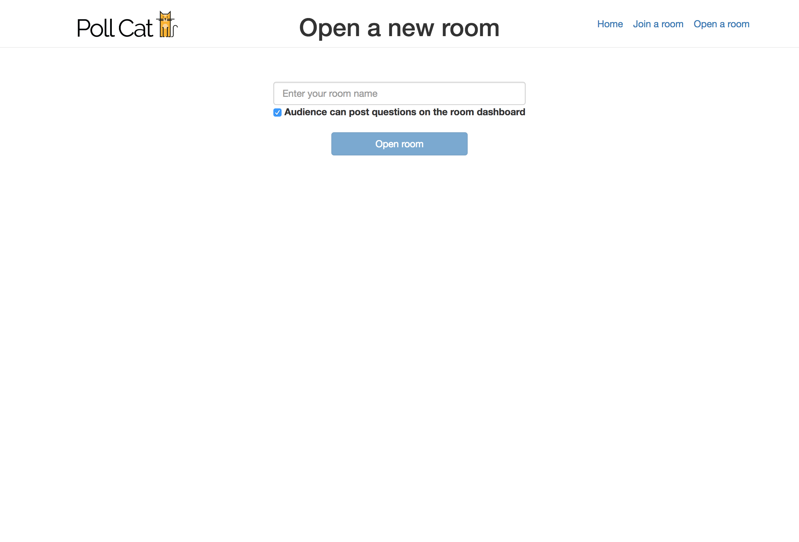
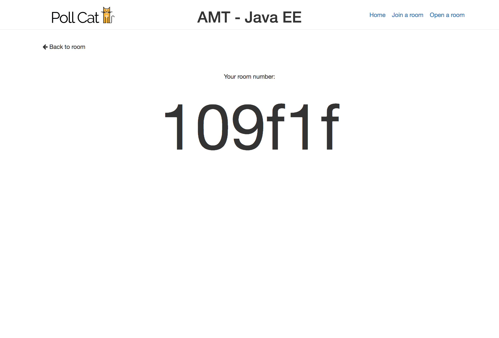
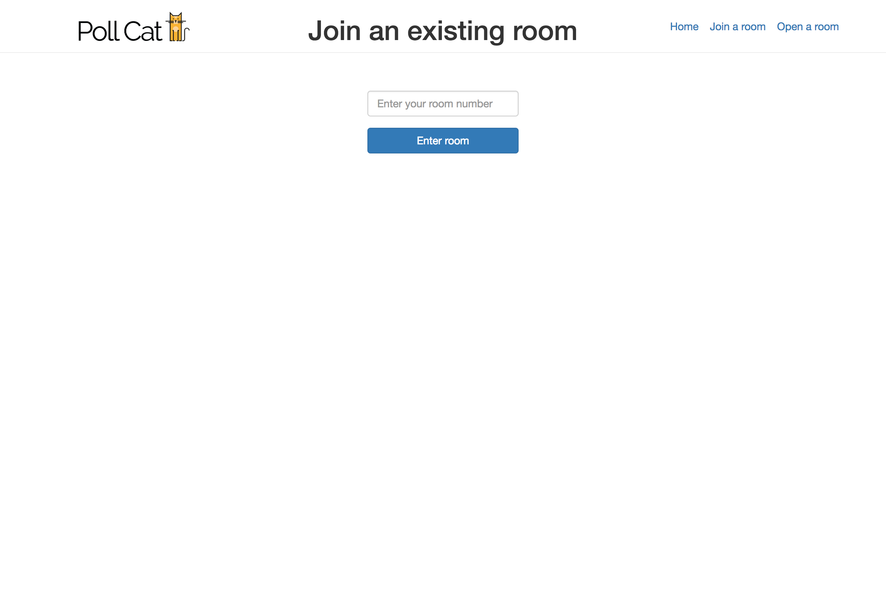
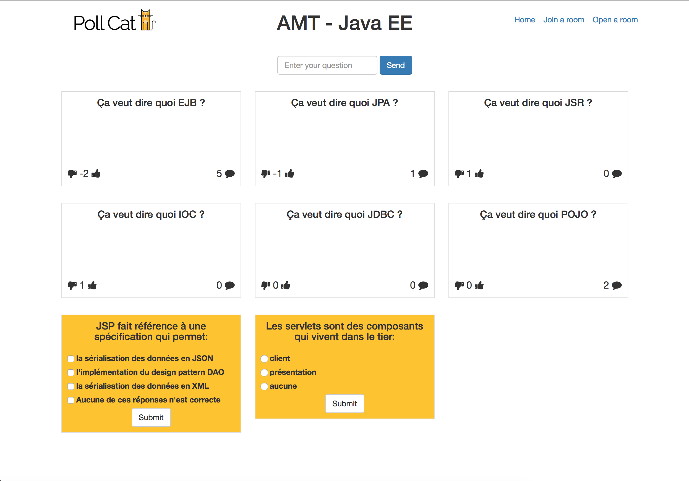
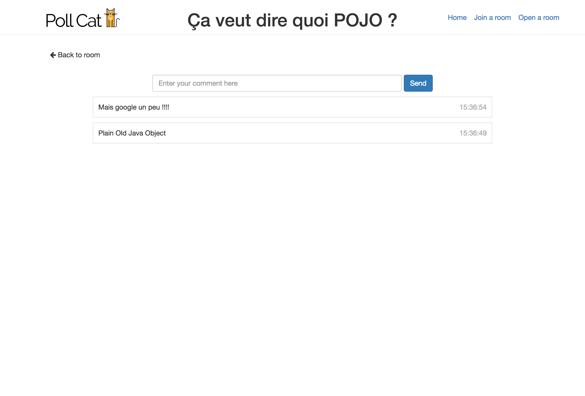
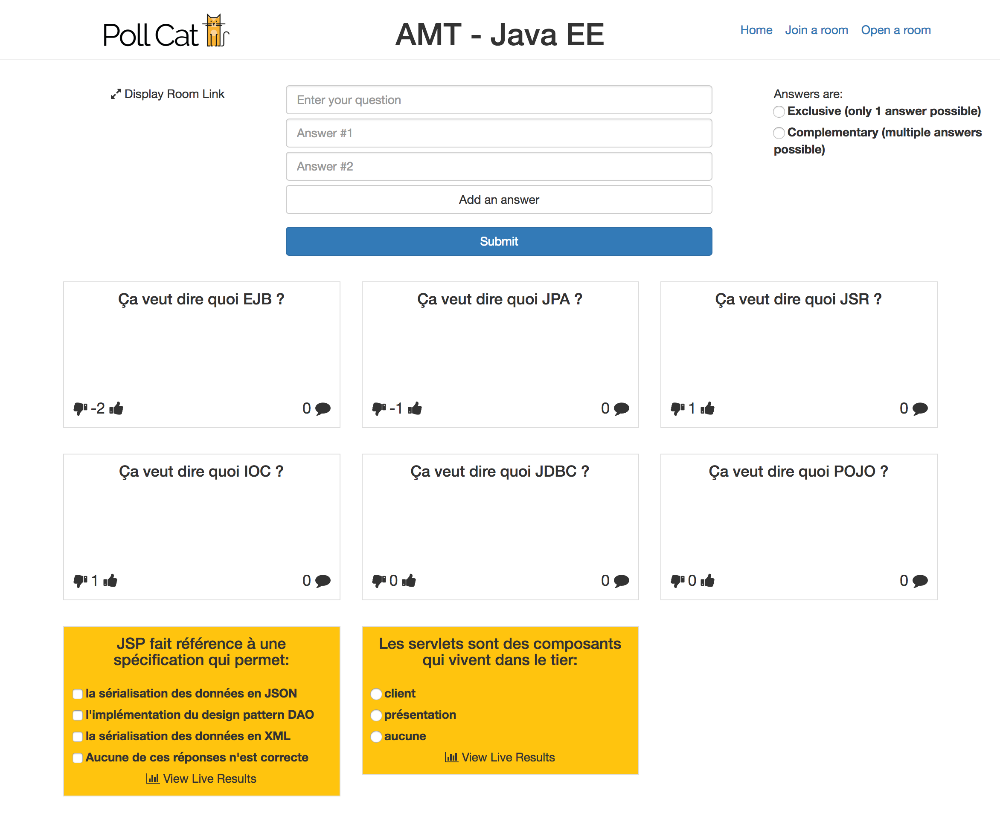
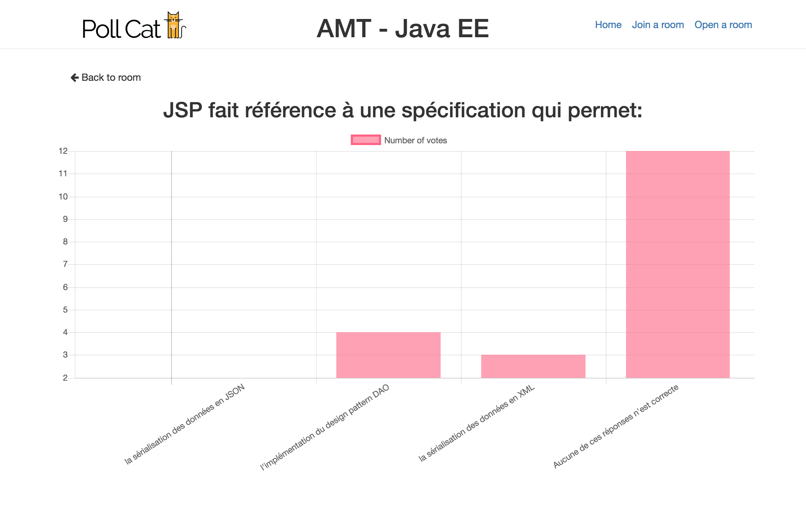

Interactive poll app for the TWEB course at HEIG-VD. The team is composed by [Loïc Serafin](https://github.com/pikkle) and [Julien Leroy](https://github.com/limayankee) 

## Brief description
This project intends to offer a web application usable by a speaker and its audience, mainly for a teacher and his/her students. 
They can interract with each other with questions and polls. Only the speaker can open a poll which the user can respond to.
The speaker can also have a visualisation for each poll showing statistics of poll participations. The audience can also ask
questions about the speech and can comment existing questions. They can also evaluate the relevance of a question.

## Technologies
We are using the following technologies:
### Client technologies
- [Angular2](https://angular.io/)
- [Webpack](https://webpack.github.io/)
- [Npm](https://www.npmjs.com/)
- [WebSocket](https://developer.mozilla.org/fr/docs/WebSockets)

### Server technologeis
- [Python](https://www.python.org/)
- [Django](https://www.djangoproject.com/)
- [SQLite](https://sqlite.org/)
- [Channels (ws)](https://channels.readthedocs.io/en/stable/)

## Requirements
You will need the following programs to run the server:
- Docker **1.13**
- Docker-compose **1.10**

## Instructions
**For local deployment only**
- Clone the repo
- Ensure that the ports *8080* and *8000* are free
- Run the following command: `docker-compose up`
- The app is now running on [http://localhost:8080](http://localhost:8080)

## Screenshots

#### Index page
a simple index page that leads to either joining or opening a room

#### The room creation interface
a simple interface to create a room. Lets the choice to the room admin to let the other users to post questions or not.

#### The room displaying interface
that shows simply the room number for your audience to join in.

#### The room joining interface
that has a simple form to join in a room.

#### The audience interface
that shows live questions from other people in white stickers, and pollings from the speaker in yellow stickers.

#### The comment interface
that allow users to comment questions.

#### The speaker interface
that shows questions from the audience and access to live results to polls.

#### The stats interface
that shows a bar chart of responses from the audience to a poll.

